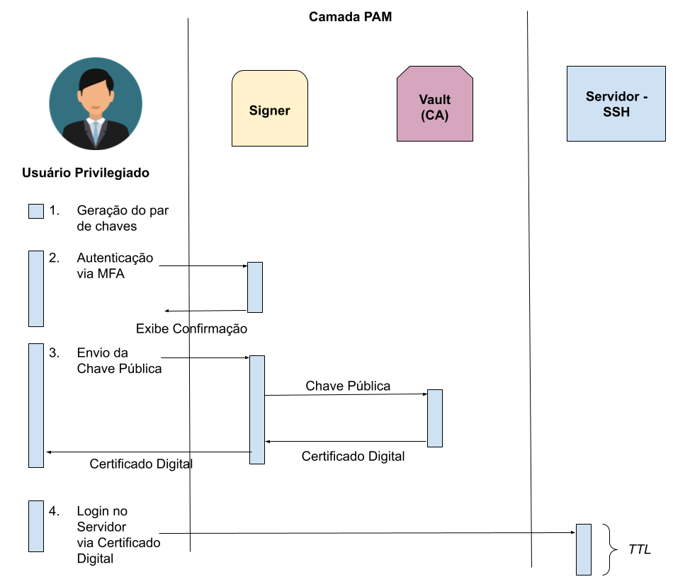

# Trabalho de Segurança de Sistemas - SSH com Certificados


---

## Descrição

Projeto desenvolvido para a disciplina **Segurança de Sistemas**.  
Implementa o fluxo de autenticação SSH com certificados temporários, conforme o diagrama do professor (imagem abaixo).



O sistema é feito inteiramente em **Rust**, usando o framework **Actix**.  
Cada componente representa uma parte do processo de autenticação via certificado digital.

---

## Componentes

- **client/** → Gera ou envia uma chave pública e solicita certificado.  
- **signer/** → Autentica o usuário (MFA) e pede assinatura ao Vault.  
- **vault/** → Autoridade certificadora (CA) que assina as chaves.  

---

## Resumo

O usuário gera uma chave ou envia para o *signer*, faz autenticação MFA, o *vault* assina a chave e devolve um certificado válido por tempo limitado (ex: 10 minutos).  
Com esse certificado, o usuário pode se conectar ao servidor SSH.

---

```bash
cd vault/
python -m venv venv
source venv/bin/activate
pip install -r requirements.txt

```

```bash
sudo apt install libsqlite3-dev libssl-dev pkg-config

```